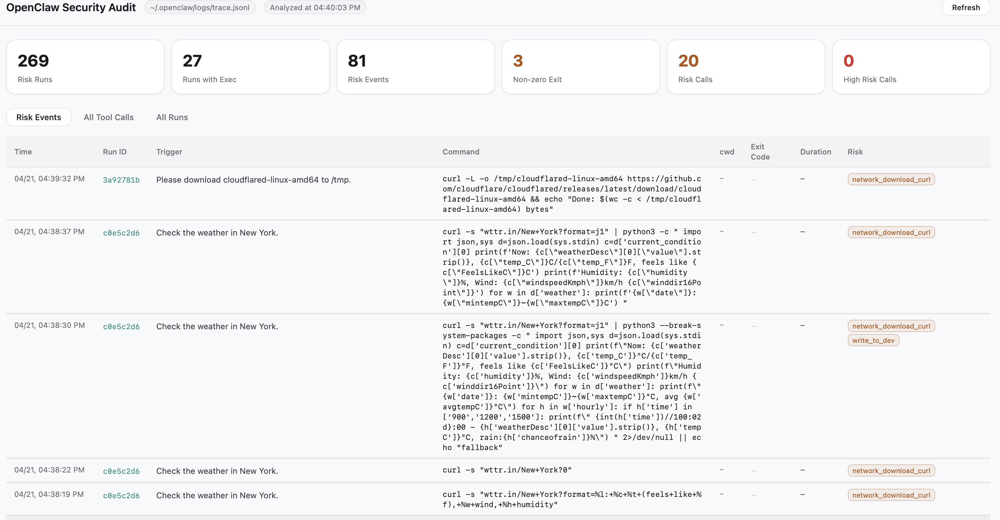
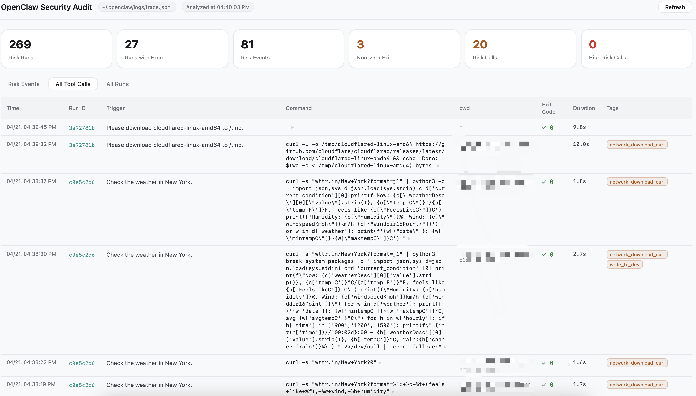
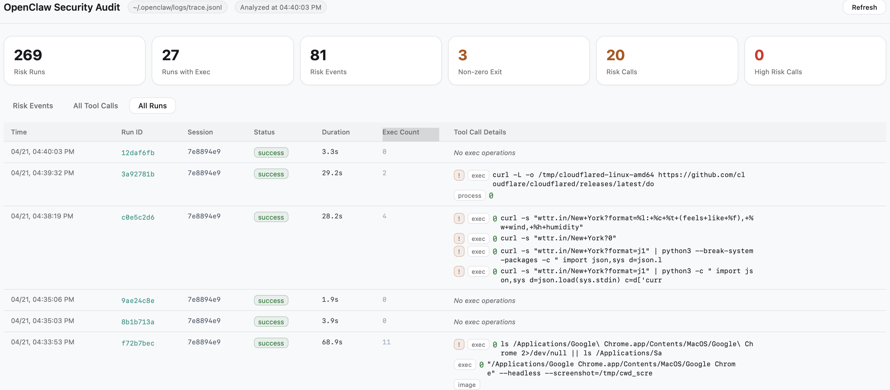

# OpenClaw Security Audit — Installation Guide

This plugin adds a near real-time security audit pipeline on top of your OpenClaw gateway: trace collection, DuckDB risk analysis, and a local web dashboard for reviewing risky tool calls.

---

## Dashboard Preview

### Risk Events — flagged tool calls at a glance

The **Risk Events** tab surfaces every tool call that matched a security rule, showing the trigger prompt, the exact shell command executed, working directory, exit code, duration, and the matched risk tag (e.g. `network_download_curl`, `write_to_dev`).



---

### All Tool Calls — full audit trail with risk tagging

The **All Tool Calls** tab lists every tool call across all runs. Each row includes the raw command, exit code, duration, and any risk tags assigned by the DuckDB rule engine — giving you a complete, searchable audit log.



---

### All Runs — run history with exec details

The **All Runs** tab shows each agent run's session, overall status, total duration, exec count, and an inline expansion of every shell command that was invoked — useful for correlating a flagged event back to its full execution context.



---

## Prerequisites

- OpenClaw is installed and the **gateway** runs correctly.
- Node.js **18 or later** is available on your PATH (`node -v`).
- macOS or Linux (Windows users should run under **WSL2**).

---

## Quick Installation (3 commands)

```bash
# 1. Ensure the extensions directory exists and clone this repo
mkdir -p ~/.openclaw/extensions
git clone https://github.com/WinxCla/openclaw-security-audit \
  ~/.openclaw/extensions/openclaw-security-audit

# 2. Install dependencies and patch OpenClaw config
cd ~/.openclaw/extensions/openclaw-security-audit && ./install.sh

# 3. Restart the OpenClaw gateway to activate the plugin
openclaw gateway stop
openclaw gateway &
```

After installation, launch the audit dashboard:

```bash
node ~/.openclaw/secaudit.js
# Browser opens automatically at http://localhost:7788
```

### Installing via OpenClaw Chat

Paste the repository URL and say:

> "Please install this plugin according to INSTALL.md: https://github.com/WinxCla/openclaw-security-audit"

---

## What `install.sh` Does

| Step | Action |
| :-- | :-- |
| Preflight | Verifies Node.js ≥ 18, checks `~/.openclaw/openclaw.json` exists and is valid JSON |
| npm install | Installs DuckDB and other Node dependencies (~50 MB, first run ~1–2 minutes) |
| Copy dashboard | Copies `secaudit.js` / `secaudit.py` into `~/.openclaw/` (overwriting older versions, if any) |
| Patch config | Appends plugin registration to `openclaw.json` and auto-rolls back on any failure |

### Config Changes (`openclaw.json`)

`install.sh` merges the following structure into your existing `openclaw.json`:

```json
{
  "plugins": {
    "allow": ["openclaw-security-audit"],
    "entries": {
      "openclaw-security-audit": { "enabled": true }
    },
    "installs": {
      "openclaw-security-audit": {
        "source": "path",
        "installPath": "~/.openclaw/extensions/openclaw-security-audit",
        "version": "1.0.0",
        "installedAt": "<ISO timestamp>"
      }
    }
  }
}
```

- Existing `plugins` configuration is preserved and merged.
- The original file is backed up as `openclaw.json.bak.<timestamp>` and restored if the patch fails.

If you use multiple gateway profiles with different config paths, adjust `openclaw.json` to the correct profile before running `install.sh`.

---

## Manual Installation (without `install.sh`)

If you prefer to install step by step:

```bash
# 1. Ensure the extensions directory exists and clone this repo
mkdir -p ~/.openclaw/extensions
git clone https://github.com/WinxCla/openclaw-security-audit \
  ~/.openclaw/extensions/openclaw-security-audit

# 2. Install npm dependencies
cd ~/.openclaw/extensions/openclaw-security-audit
npm install --omit=dev

# 3. Copy audit dashboard binaries
cp secaudit.js secaudit.py ~/.openclaw/

# 4. Register the plugin in openclaw.json
node -e "
  const fs = require('fs');
  const home = process.env.HOME;
  const p = home + '/.openclaw/openclaw.json';
  const c = JSON.parse(fs.readFileSync(p, 'utf8'));
  if (!c.plugins)          c.plugins          = {};
  if (!c.plugins.allow)    c.plugins.allow    = [];
  if (!c.plugins.entries)  c.plugins.entries  = {};
  if (!c.plugins.installs) c.plugins.installs = {};
  const id = 'openclaw-security-audit';
  if (!c.plugins.allow.includes(id)) c.plugins.allow.push(id);
  c.plugins.entries[id]  = { enabled: true };
  c.plugins.installs[id] = {
    source: 'path',
    installPath: home + '/.openclaw/extensions/openclaw-security-audit',
    version: '1.0.0',
    installedAt: new Date().toISOString()
  };
  fs.writeFileSync(p, JSON.stringify(c, null, 2) + '\n');
  console.log('openclaw.json updated');
"

# 5. Restart the gateway
openclaw gateway stop
openclaw gateway &
```

---

## Key Registration Constraints

### 1. `source` must be one of the allowed enum values

The `plugins.installs[id].source` field in `openclaw.json` only accepts:

```
"npm" | "archive" | "path" | "clawhub" | "marketplace"
```

Using `"git"` or any other value causes a **Config invalid** error on gateway startup and the plugin will not load.
This plugin uses `"path"`.

### 2. Always restart the gateway via the official CLI

On macOS the gateway is managed by a **LaunchAgent** (`ai.openclaw.gateway`). Killing the process directly (e.g. `pkill`) causes the system to auto-restart it, often resulting in `EADDRINUSE` port conflicts.

```bash
# Correct
openclaw gateway stop
openclaw gateway &

# Wrong (may trigger port conflicts)
pkill -f "openclaw gateway"
```

If you run multiple gateways or use custom profiles, restart the appropriate gateway instance using the same pattern.

### 3. Plugin id must match in four places

The plugin id must be exactly the same in all of the following:

| Location | Field |
| :-- | :-- |
| `openclaw.plugin.json` | `"id"` |
| `openclaw.json` → `plugins.allow[]` | array element |
| `openclaw.json` → `plugins.entries` | key |
| `openclaw.json` → `plugins.installs` | key |

Mismatched ids cause the plugin to be skipped or hooks not to fire.

### 4. Verify the plugin loaded

After restarting the gateway, check its log output. A successful load looks like:

```text
[openclaw-security-audit] hooks registered successfully
[gateway] ready (N plugins, 0.6s)
```

If you do not see this line, double-check `openclaw.json` and the id fields above.

---

## Directory Structure

After installation, your layout should look like this:

```text
~/.openclaw/
├── extensions/
│   └── openclaw-security-audit/    ← this repo (git clone target)
│       ├── index.js                # Hook registration + command classification
│       ├── analyze.js              # DuckDB risk analysis engine
│       ├── rules.json              # 11 security rules (shared by JS/Python tools)
│       ├── openclaw.plugin.json    # Plugin manifest
│       ├── package.json            # npm dependencies (DuckDB, etc.)
│       ├── secaudit.js             # Audit dashboard (Node.js)
│       ├── secaudit.py             # Audit dashboard (Python)
│       └── install.sh              # This install script
├── secaudit.js                     ← copied here by install.sh
├── secaudit.py
└── openclaw.json                   ← plugin registration appended by install.sh
```

---

## Uninstall

To remove the plugin cleanly:

```bash
# 1. Remove plugin from config
node -e "
  const fs = require('fs');
  const p = process.env.HOME + '/.openclaw/openclaw.json';
  const c = JSON.parse(fs.readFileSync(p, 'utf8'));
  if (c.plugins && Array.isArray(c.plugins.allow)) {
    c.plugins.allow = c.plugins.allow.filter(x => x !== 'openclaw-security-audit');
  }
  if (c.plugins && c.plugins.entries) {
    delete c.plugins.entries['openclaw-security-audit'];
  }
  if (c.plugins && c.plugins.installs) {
    delete c.plugins.installs['openclaw-security-audit'];
  }
  fs.writeFileSync(p, JSON.stringify(c, null, 2) + '\n');
  console.log('openclaw-security-audit removed from openclaw.json');
"

# 2. Restart the gateway
openclaw gateway stop
openclaw gateway &

# 3. Delete files (optional)
rm -rf ~/.openclaw/extensions/openclaw-security-audit
rm -f  ~/.openclaw/secaudit.js ~/.openclaw/secaudit.py
```
